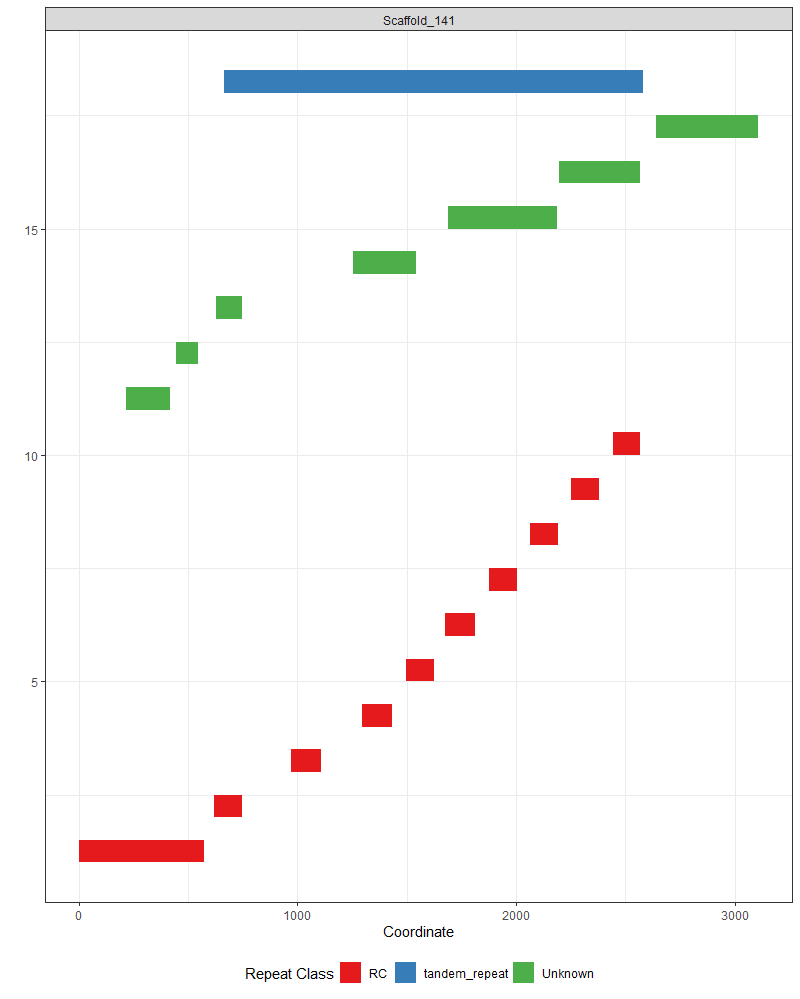
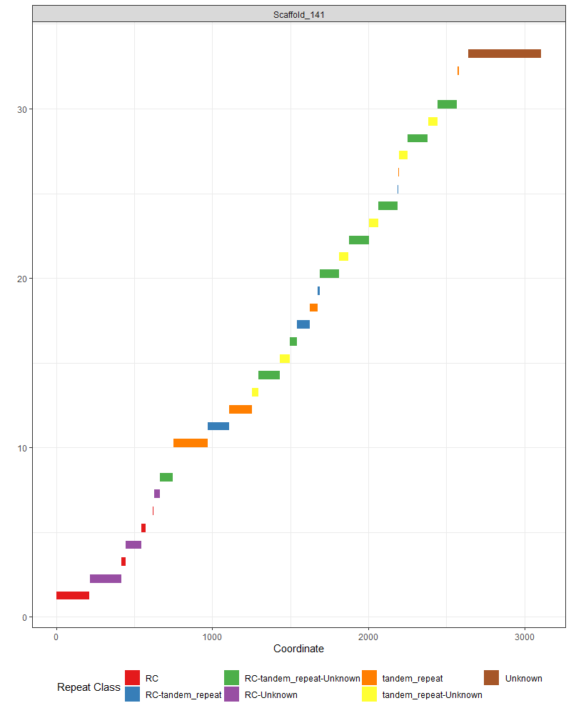
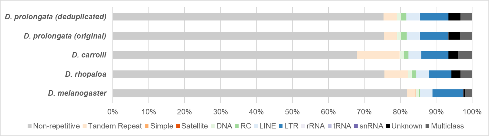
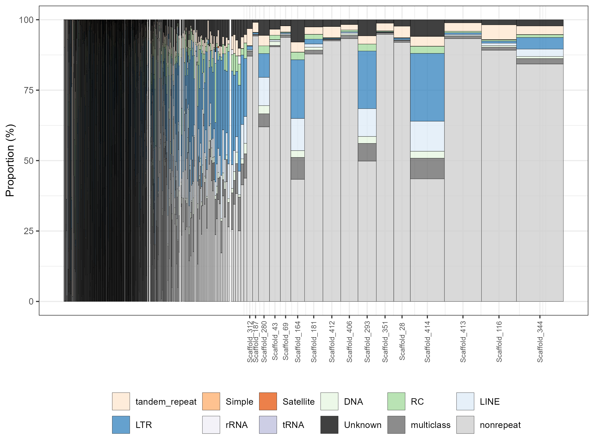
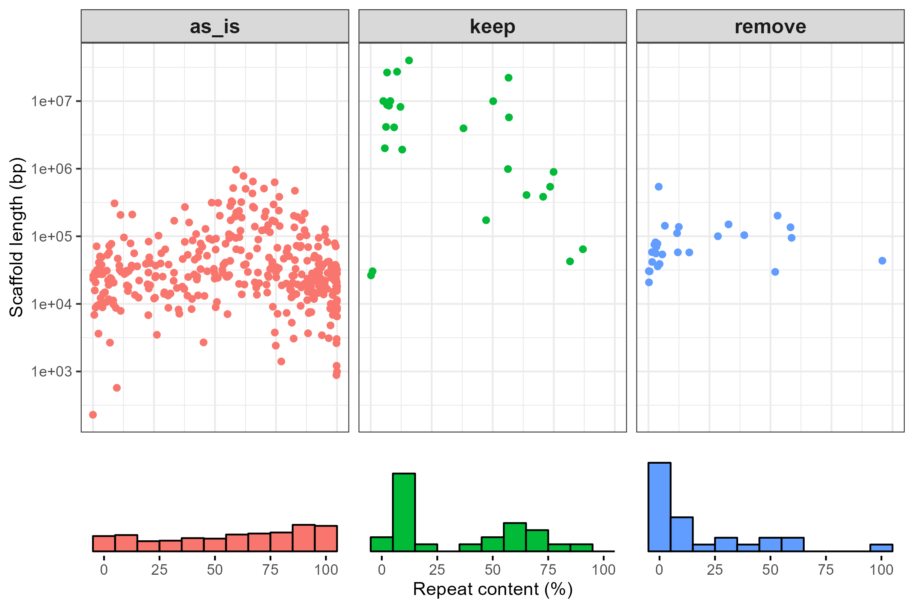

## Repeat_analysis

This GitHub repo is the companion of the repeat analysis section of the first _D. prolongata_ genome assembly paper by Luecke et al., 2023. Two major software were used:

*  [Tandem Repeat Finder](https://tandem.bu.edu/trf/trf.html)
*  [Repeatmodeler](https://github.com/Dfam-consortium/RepeatModeler)

  where TRF is to identify simple tandem repeats, and repeatmodeler is to further identify complex transposable elements.

### Methods
#### Repeat classification

Suppose one is dealing with 3 repeat classes: `Rolling Circle (RC)`, `Tandem repeat`, and `Unknown`. Note that overlaps could exist between repeat classes:

To correctly determine if any stretch of DNA is `repetitive` or `non-repetitive`, one needs to carefully delimits the boundary of repeat classes, bearing in mind potential overlaps between categories. Inside the paper, I provide the solution of conservatively assigning a single repeat class to regions that only have one unique repeat annotation, and treat regions with overlapped repeat categories as `Multiclass`. This can be achieved by the `disjoin()` function in the R Bioconductor package `GenomicRanges`. For example, the blue region in the following figure are shared by `RC` and `Tandem repeat`, and assigned to a new hybrid class `RC-Tandem repeat`, which will be aggregated into a generic `Multiclass` later in the workflow.

### Results

#### Compare repeat content across species

*  _D. prolongata_ shows moderate (~24.6%) and comparable levels of overall repeat content as with three reference species
*  Deduplication of Dovetail HiRise assembly does not change much on the repeat content in _D. prolongata_
*  The top 3 repeat classes are Long Interspersed Nuclear Elements ([LINEs](https://en.wikipedia.org/wiki/Long_interspersed_nuclear_element)), Long Terminal Repeat retrotransposons ([LTRs](https://en.wikipedia.org/wiki/Long_terminal_repeat)), and tandem repeats in _D. prolongata_

| species	| seqlengths	| Non-repetitive	| Tandem Repeat	| Simple | Satellite | DNA | RC	| LINE | LTR | rRNA | snRNA	| tRNA | Unknown | Multiclass |
|---------|-------------|-----------------|---------------|--------|-----------|-----|----|------|-----|------|-------|------|---------|------------|
|_D. melanogaster_| 143726002 | 81.879	| 2.421	| 0.007	| 0.031	| 0.877	| 0.218	| 3.526	| 8.525	| 0.040	| 0.000	| 0.005	| 0.575	| 1.896 |
|_D. rhopaloa_|193508231 |75.594	|6.601	|0.008	|0.012	|0.971	|1.274	|3.612	|6.141	|0.000	|0.004	|0.004	|2.519	|3.260|
|_D. carrolli_|231219246 |67.869	|12.003	|0.007	|0.017	|1.224	|1.122	|3.626	|7.505	|0.014	|0.001	|0.001	|2.686	|3.926|
|_D. prolongata_ (original)|	223340102 	|75.418	|3.621	|0.008	|0.019	|1.061	|1.619	|3.698	|7.889	|0.060	|0.000	|0.005	|3.280	|3.320|
|_D. prolongata_ (deduplicated)|	220759777 |75.364	|**3.627**	|0.008	|0.019	|1.067	|1.595	|**3.727**	|**7.939**	|0.061	|0.000	|0.005	|3.276	|3.311|

#### Compare repeat content across scaffolds in _D. prolongata_

*  Major (>1Mb) scaffolds tend to have less repeat content, with a few exceptions (some are likely to be fragments of Y chromosome)
*  Intermediate-sized scaffolds tent to have more repeat content

#### Compare repeat content across duplication status in _D. prolongata_

*  Retained scaffolds tend to be large (>50kb)
*  Removed scaffolds tend to have low, rather than high repeat content

